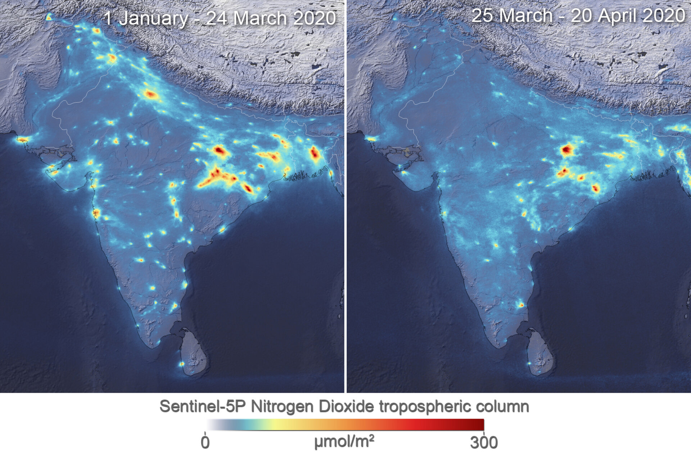
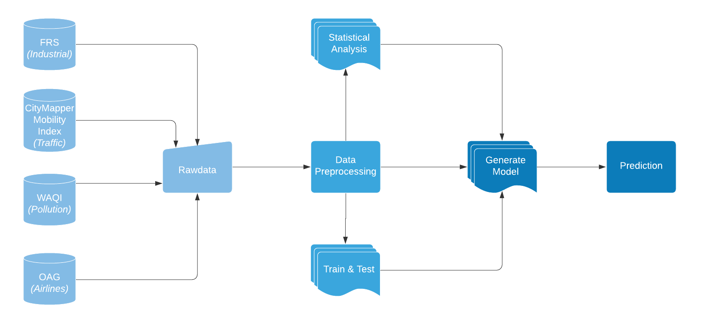

# COVID-19: A Boon for Nature

## Introduction
Air Pollution causes more than seven million deaths per year. In 2018, USA linked to nearly 10,000 additional deaths. More than 3/4 of annual greenhouse gases gets produced by transportation, industry, and power generation resulting in forcing the 90% of the global population to breath in unsafe air. 

The novel COVID-19 virus has left the world reeling with thousands of deaths and lakhs of cases. The entire human life has come to a standstill with the majority of the countries enforcing shutdown/lockdown and travel bans. 

Amidst this chaos, there is an unlikely beneficiary in the form of mother nature. There is a drastic reduction in air pollution
all over the world which has been a major concern over the years.

## About
This positive outcome has inspired me to research more on the datasets available and predict the impact of improved air quality on the overall ecosystem, such as by how far the melting of polar ice will be pushed which was originally predicted at 2100. The positive aspect of this pandemic could be an eye opener to reanalyze the parameters which play a vital role in a healthier environment. This might encourage people to keep the air immaculate once this lockdown is over.

## Working and Evaluation Methodology

Given data was split into the period before shelter in placestarted and after it. The data after shelter in place was setaside for comparison with the predicted data. Data from 2014 to shelter in place was used to train the time series model,which resulted in prediction of the content of pollutants if shelter in place would not have happened.

Three models naming Auto-Regression, Moving Average,Seasonal Autoregressive Integrated Moving Average were used for time series prediction. Results from these models was tested by keeping aside known testing values from January to the date of Lock-down and then later comparing this to the predicted value by the
model.

Eventually, Moving Average model came to perform best with repeat to others. RMSE value was used to check the
accuracy. Finally, Moving Average algorithm was used to predict unknown values for all other cities using complete
known dataset. Figure 7 shows the final predicted graph for the PM2.5 content with Shelter in place and without it for predicted valus of 2020.

## Tech Stack And System Design

### Algorithms

Statsmodel library of python was used to perform time series prediction. Statsmodel have numerous models, 3 of which we used are described below.

1) Auto-regression: An auto-regressive (AR) model predicts future behavior based on past behavior. The process is basically a linear regression of the data in the current series against one or more past values in the same series.
AR model usually gets “close enough” for it to be useful in most scenarios.

2) Moving Average: A moving average is a technique to get an overall idea of the trends in a data set; it is an average of any subset of numbers.

3) Seasonal Autoregressive Integrated Moving Average: Seasonal Autoregressive Integrated Moving Average,SARIMA or Seasonal ARIMA, is an extension of ARIMA that explicitly supports univariate time series data with a seasonal component. It adds three new hyperparameters to specify the autoregression (AR), differencing (I) and moving
average (MA) for the seasonal component of the series as well as an additional parameter for the period of the seasonality.

### Technologies Used

1) Programming: Python was used for programming. Python provides support to libraries like statsmodel which
make data analysis easy. Statsmodel have various time-series models to choose from.

2) Visualization: Seaborn, Plotly and Matplotlib was used for visualising different graphs. Dash is used to buid visualization dashboard.

### Architecture

## Instructions 

1. Clone this repository using `git clone git@github.com:UtkarshChaurasia/Autho-Hackathon.git`
2. Install python using `sudo apt-get install python3.6`
3. Switch to repository folder. 
3. Install all the required libraries using `pip install -r requirements.txt`
4. Run app.py file using `python app.py`

The dashboard will be up and running on your favourite browser.

## Conclusion

Using the timeline of lockdowns and comprehensive dataset of air pollution we found out that COVID-19 despite its heavy economic toll on society has a very positive effect on the global air quality for the time being. According to this year’s Air Quality Index cities with historic levels of PM 2.5 have witnessed a dramatic drop in air pollution since enforcing lockdown; 44% in Wuhan, 54% in Seoul, and 60% in New Delhi[5]. According to researchers led by Xiao Wu at Harvard University[6] an increase of just 1 microgram per cubic meter corresponded to a 15% increase in Covid- 19 deaths. So we can safely say that this quarantine period has indeed been more life saving than life-threatening.

## Future Suggestion

1. Electric Vehicles: Make electric vehicles the new normal and out number the conventional cars.
2. Renewable Power: Sink tax dollars and resources into clean-energy subsidies.
3. Afforestation: Regrow enough trees to cover India Twice.
4. Carbon Tax: Charge polluters $75 for every metric ton of CO2 they produce.
5. Nuclear Power: Mandate government handouts to source 11% of energy production through nuclear fuel.

If notebooks are not opening, then copy and paste the link of notebooks here: https://nbviewer.jupyter.org/
